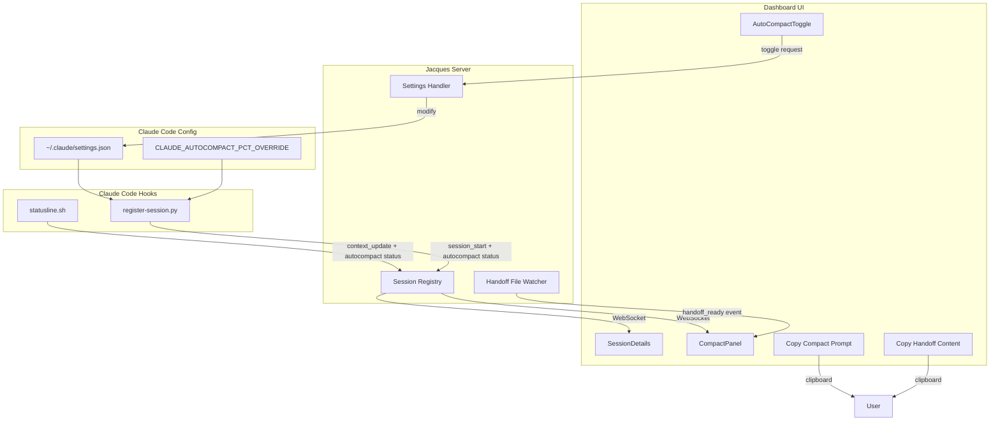

# Manual Compact Workflow - Feature Plan

## Background

### The Problem: Claude Code's Auto-Compact Limitations

Claude Code automatically compacts (summarizes) your conversation context when it reaches approximately 95% of the context window. While this prevents hitting hard limits, it has significant drawbacks:

1. **Loss of Control** - Compaction happens at arbitrary points, often mid-task
2. **Quality Degradation** - Claude's auto-generated summaries may lose important nuances
3. **No User Input** - Users can't influence what gets preserved vs. summarized
4. **Timing Issues** - Auto-compact may trigger right before you wanted to save important context

### The `autoCompact: false` Setting and Its Bug

Claude Code allows disabling auto-compact via `~/.claude/settings.json`:

```json
{
  "autoCompact": false
}
```

**However, there's a known bug (GitHub Issue #18264):** Even with `autoCompact: false`, compaction still triggers at approximately 78% context usage. The setting is being ignored in Claude Code 2.1.7+.

### The Solution: Manual Compact Workflow

Instead of relying on Claude's auto-compact (which either triggers unexpectedly or has buggy behavior), users can:

1. **Disable auto-compact** (even though it's buggy, it raises the threshold)
2. **Monitor context usage** via Jacques dashboard
3. **Manually create quality handoff documents** before any threshold is hit
4. **Start fresh sessions** with the handoff as initial context

This gives users full control over what context gets preserved and how.

---

## Feature Overview

This plan adds three key features to Jacques:

| Feature                         | Description                                     |
| ------------------------------- | ----------------------------------------------- |
| **Manual Compact Workflow**     | UI panel with copy buttons for handoff prompts  |
| **Auto-Compact Status Display** | Show ON/OFF status with bug warnings            |
| **Auto-Compact Toggle**         | Click to enable/disable directly from dashboard |

---

## Architecture

```
┌─────────────────────────────────────────────────────────────────┐
│                    JACQUES COMPACT WORKFLOW                      │
├─────────────────────────────────────────────────────────────────┤
│                                                                  │
│  1. User working, monitors context in Jacques dashboard          │
│                                                                  │
│  2. Dashboard shows: "Context at 65% - Auto-compact: [OFF]"     │
│                      [a] to toggle auto-compact                  │
│                                                                  │
│  3. At 70%, CompactPanel appears with instructions:              │
│     ┌────────────────────────────────────────────────┐          │
│     │ ⚠️  Consider creating a handoff document       │          │
│     │                                                │          │
│     │ Step 1: [📋 Copy Compact Prompt]               │          │
│     │ Step 2: Paste in Claude, wait for file        │          │
│     │ Step 3: [📋 Copy Handoff Content]             │          │
│     │ Step 4: Start new session, paste handoff      │          │
│     └────────────────────────────────────────────────┘          │
│                                                                  │
│  4. User pastes prompt into Claude:                              │
│     "Create a handoff document at .jacques-handoff.md..."        │
│                                                                  │
│  5. Claude writes the file, Jacques detects it                   │
│                                                                  │
│  6. User copies handoff content, starts NEW session              │
│                                                                  │
│  7. User pastes handoff as first message in new session          │
│                                                                  │
│  8. New session continues with clean, focused context            │
│                                                                  │
└─────────────────────────────────────────────────────────────────┘
```

### Component Flow



---

## Feature 1: Manual Compact Workflow

### The Perfect Compact Prompt

When users click "Copy Compact Prompt", they get this template:

```markdown
Please create a comprehensive handoff document for continuing this work in a new session.
Save it to `.jacques-handoff.md` in the project root.

Structure it as follows:

## Current Task

[What we're working on and the end goal]

## Progress Made

[Bullet points of what's been accomplished]

## Key Decisions

[Important choices made and reasoning]

## Current State

[Exactly where we left off, any in-progress work]

## Next Steps

[Prioritized list of what needs to be done next]

## Important Files

[List of files that were modified or are critical to understand]

- path/to/file.ts - description of changes/relevance

## Essential Context

[Any background info, constraints, or gotchas the next session needs to know]

Keep it focused and actionable - this will be my starting context in a fresh session.
```

### CompactPanel Component States

| State          | Condition                    | UI                                             |
| -------------- | ---------------------------- | ---------------------------------------------- |
| **Hidden**     | Context < 60%                | Panel not shown                                |
| **Suggestion** | Context 60-70%               | Subtle suggestion to prepare                   |
| **Warning**    | Context > 70%                | Full instructions + Copy Compact Prompt button |
| **Ready**      | `.jacques-handoff.md` exists | Copy Handoff Content button appears            |

### Handoff File Detection

The server watches for `.jacques-handoff.md` in each active session's project directory:

```typescript
// Server watches for handoff files
const watcher = fs.watch(session.cwd, (eventType, filename) => {
  if (filename === ".jacques-handoff.md") {
    broadcastToClients({
      type: "handoff_ready",
      session_id: session.session_id,
      path: path.join(session.cwd, filename),
    });
  }
});
```

---

## Feature 2: Auto-Compact Status Display

### What We Display

```
┌─────────────────────────────────────────────┐
│ Auto-compact: [OFF] (bug may trigger ~78%)  │
│ Context: 65%  ████████████░░░░░░░░          │
│ ⚠️ Manual compact recommended at 70%        │
└─────────────────────────────────────────────┘
```

Or when enabled:

```
┌─────────────────────────────────────────────┐
│ Auto-compact: [ON] at 95%                   │
│ Context: 72%  ██████████████░░░░░░          │
└─────────────────────────────────────────────┘
```

### Detection Logic

Read auto-compact settings from two sources:

1. **`~/.claude/settings.json`** - The `autoCompact` field (true/false)
2. **`CLAUDE_AUTOCOMPACT_PCT_OVERRIDE`** - Environment variable for custom threshold

```python
def get_autocompact_settings():
    """Read auto-compact settings from Claude Code config."""
    settings_path = Path.home() / '.claude' / 'settings.json'

    autocompact_enabled = True  # Default
    autocompact_threshold = 95  # Default

    # Check settings.json
    if settings_path.exists():
        try:
            with open(settings_path) as f:
                settings = json.load(f)
                if 'autoCompact' in settings:
                    autocompact_enabled = settings['autoCompact']
        except:
            pass

    # Check env var for custom threshold
    threshold_override = os.environ.get('CLAUDE_AUTOCOMPACT_PCT_OVERRIDE')
    if threshold_override:
        try:
            autocompact_threshold = int(threshold_override)
        except:
            pass

    return {
        'autocompact_enabled': autocompact_enabled,
        'autocompact_threshold': autocompact_threshold,
        'autocompact_bug_threshold': 78 if not autocompact_enabled else None
    }
```

### Data Structures

```typescript
// Types for auto-compact status
export interface AutoCompactStatus {
  enabled: boolean; // From settings.json autoCompact field
  threshold: number; // 95 default, or from env var
  bug_threshold: number | null; // 78 if disabled (known bug), null if enabled
}

export interface Session {
  // ... existing fields
  autocompact: AutoCompactStatus;
}
```

---

## Feature 3: Auto-Compact Toggle

### One-Click Enable/Disable

Users can toggle auto-compact directly from the Jacques dashboard:

```
Auto-compact: [ON]  ← click or press 'a'
              ↓
Auto-compact: [OFF] (bug may trigger at ~78%)
```

### Implementation

**Settings Utility:**

```typescript
// dashboard/src/utils/settings.ts
import { readFileSync, writeFileSync } from "fs";
import { homedir } from "os";
import { join } from "path";

const CLAUDE_SETTINGS_PATH = join(homedir(), ".claude", "settings.json");

export function getClaudeSettings(): Record<string, unknown> {
  try {
    const content = readFileSync(CLAUDE_SETTINGS_PATH, "utf-8");
    return JSON.parse(content);
  } catch {
    return {};
  }
}

export function setAutoCompact(enabled: boolean): void {
  const settings = getClaudeSettings();
  settings.autoCompact = enabled;
  writeFileSync(CLAUDE_SETTINGS_PATH, JSON.stringify(settings, null, 2));
}

export function toggleAutoCompact(): boolean {
  const settings = getClaudeSettings();
  const currentValue = settings.autoCompact !== false; // Default is true
  const newValue = !currentValue;
  setAutoCompact(newValue);
  return newValue;
}
```

**WebSocket Protocol:**

```typescript
// Request
export interface ToggleAutoCompactRequest {
  type: "toggle_autocompact";
  session_id?: string;
}

// Response
export interface AutoCompactToggledResponse {
  type: "autocompact_toggled";
  enabled: boolean;
  warning?: string; // "Bug may still trigger at ~78%"
}
```

**Keyboard Shortcut:**

Press `[a]` to toggle auto-compact:

```typescript
useInput((input) => {
  if (input === "a") {
    client.send({ type: "toggle_autocompact" });
  }
});
```

---

## File Changes Summary

| File                                             | Change                                                  |
| ------------------------------------------------ | ------------------------------------------------------- |
| `dashboard/src/components/CompactPanel.tsx`      | New component for compact workflow UI                   |
| `dashboard/src/components/AutoCompactToggle.tsx` | New toggle component for ON/OFF switch                  |
| `dashboard/src/components/Dashboard.tsx`         | Add CompactPanel and toggle to layout                   |
| `dashboard/src/components/SessionDetails.tsx`    | Add auto-compact status display with bug warning        |
| `dashboard/src/templates/compact-prompt.ts`      | New file with handoff prompt template                   |
| `dashboard/src/utils/settings.ts`                | New utility for reading/writing ~/.claude/settings.json |
| `dashboard/src/types.ts`                         | Add `AutoCompactStatus`, `handoff_ready` types          |
| `dashboard/package.json`                         | Add `clipboardy` dependency                             |
| `server/src/types.ts`                            | Add `AutoCompactStatus`, toggle request/response types  |
| `server/src/session-registry.ts`                 | Handle autocompact status in sessions                   |
| `server/src/server.ts`                           | Add file watcher + toggle handler                       |
| `hooks/statusline.sh`                            | Include autocompact enabled/threshold in payload        |
| `hooks/jacques-register-session.py`              | Read autoCompact from settings.json + env var           |

---

## Implementation Tasks

| ID  | Task                                                               | Status  |
| --- | ------------------------------------------------------------------ | ------- |
| 1   | Add `AutoCompactStatus` type to server and dashboard types         | Pending |
| 2   | Update `register-session.py` to read autoCompact from settings     | Pending |
| 3   | Add auto-compact status display with bug warning to SessionDetails | Pending |
| 4   | Create `compact-prompt.ts` with the handoff prompt template        | Pending |
| 5   | Create `CompactPanel` component with copy buttons and instructions | Pending |
| 6   | Add `clipboardy` dependency and clipboard copy functionality       | Pending |
| 7   | Add server-side file watcher for `.jacques-handoff.md` files       | Pending |
| 8   | Integrate `CompactPanel` into Dashboard layout                     | Pending |
| 9   | Add clickable toggle to switch auto-compact ON/OFF                 | Pending |
| 10  | Add `[a]` keyboard shortcut to toggle auto-compact                 | Pending |

---

## Future Enhancements

### Smart Suggestions

In future iterations, add intelligent suggestions for when to manually compact:

- "You've been working for 45 minutes, consider saving progress"
- "Large file reads detected, context growing fast"
- "You're at 70% - good time to create a handoff before the 78% bug threshold"
- Track patterns: "You usually compact around this time"

### Handoff Templates

Different templates for different scenarios:

- **Bug Fix Handoff** - Focus on reproduction steps, attempted fixes, error messages
- **Feature Development Handoff** - Focus on requirements, decisions, remaining work
- **Exploration Handoff** - Focus on findings, approaches tried, recommendations

### Automatic Handoff Suggestions

Analyze conversation to suggest what should be in the handoff:

- Detect files that were heavily modified
- Identify key decisions from conversation
- Extract TODO items and blockers

---

## Implementation Notes

1. **Auto-compact can be disabled** - Set `"autoCompact": false` in `~/.claude/settings.json`. However, there's a known bug (#18264) where compaction still triggers at ~78% even when disabled.

2. **Our workflow helps users beat the bug** - By manually compacting at 70%, users can create quality handoffs BEFORE the buggy 78% threshold.

3. **Handoff file location** - Use `.jacques-handoff.md` in project root (session's `cwd`) for easy access.

4. **Clipboard fallback** - If clipboard access fails, show the content in a modal/box that user can manually copy.

5. **Status display semantics**:
   - "Auto-compact: OFF (bug may trigger at ~78%)" - User disabled it but bug exists
   - "Auto-compact: ON at 95%" - Default enabled behavior
   - "Auto-compact: ON at 70% (custom)" - User set custom threshold via env var

---

## References

- [Claude Code Settings Documentation](https://docs.anthropic.com/en/docs/claude-code/settings)
- [GitHub Issue #18264: autoCompact: false ignored](https://github.com/anthropics/claude-code/issues/18264)
- [Everything Claude Code Guide - Context Management](https://github.com/affaan-m/everything-claude-code)
